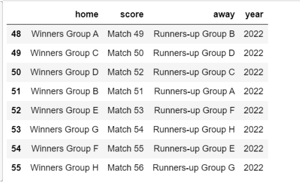
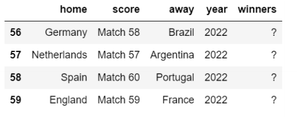
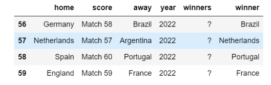
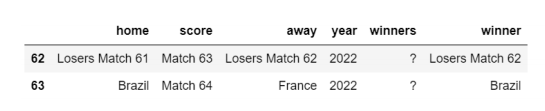

# 🏆 Football Game Winner Predictor

This project aims to **predict the winner of football games** using deep learning techniques, specifically **Deep Neural Networks (DNNs)**. The model is trained on historical football match data, analyzing features like team performance, player statistics, and match conditions to predict the winner of upcoming games.

---

## 📊 Dataset Description

The project uses an open-access dataset that includes:

### 🧩 Football Match Dataset
- Historical data on football matches
- Features include:
  - **Team statistics** (home/away, match score, etc.)
  - **Player performance** (goals scored, assists, etc.)
  - **Match conditions** (weather, venue, etc.)
  - **Other relevant features** affecting match outcomes

**Target variable:** Match outcome (Winner/Loser)

---

## ⚙️ Technologies Used

- **Language:** Python  
- **Libraries:**
  - `pandas`, `numpy`, `matplotlib`, `seaborn`
  - `scikit-learn`, `tensorflow`, `keras`, `pytorch`
  - **Deep Learning Frameworks**: TensorFlow, Keras, PyTorch
- **Platform:** Jupyter Notebook, Google Colab

---

## 🧩 Project Workflow

1. **Data Loading and Preprocessing**
   - Loaded the football match dataset
   - Handled missing data and outliers
   - Encoded categorical variables and normalized numerical features
   - Used **SMOTE** to address class imbalance

2. **Exploratory Data Analysis (EDA)**
   - Visualized the distribution of match outcomes
   - Analyzed relationships between features such as `Goals Scored`, `Team Strength`, `Home Advantage`, etc.
   - Generated correlation matrices to understand feature interactions

3. **Prediction of Match Outcome**
   - **Deep Neural Networks (DNNs)** were used to predict match outcomes (Winner vs. Loser) based on the historical data
   - The model predicts the outcome of each match by learning from the historical data of previous games

---

## 📈 Key Visualizations

### Knockouts

---

### Quarter Final

---

### Semi Final  

---

### Winner Prediction
Shows the model’s ability to distinguish between winning and losing outcomes.  

---

## 🏆 Results Summary

The model successfully predicts the winner of football matches based on historical data. It evaluates match outcomes using deep learning techniques, specifically **Deep Neural Networks (DNNs)**.
  
---

## 🚀 Future Improvements

- **Hyperparameter tuning** to improve model accuracy
- **Cross-validation** to ensure the model’s reliability across different datasets
- Explore more advanced **deep learning models** (e.g., CNNs) to predict match outcomes with raw data
- **Incorporate player statistics** for more refined predictions
- Expand the dataset to include additional match conditions or team dynamics for better generalization

---

## 👨‍💻 Author

**Afsana Azad Sarna**  
This project was developed as part of my Data Science and Machine Learning journey. I’m passionate about applying AI and machine learning to sports analytics and predictive modeling.

---

## 📚 References
  
- TensorFlow Documentation — [https://www.tensorflow.org/](https://www.tensorflow.org/)  
- Scikit-learn Documentation — [https://scikit-learn.org/](https://scikit-learn.org/)    

---

⭐ *If you like this project, don't forget to give it a star on GitHub!*

